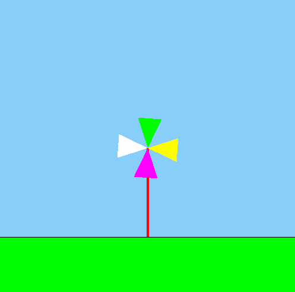

# 🌬️ Catavento em OpenGL

Este projeto foi desenvolvido como **atividade prática** para a disciplina de **Computação Gráfica** do curso de **Ciência da Computação**.  
O objetivo é criar e animar um **catavento 2D** utilizando a biblioteca **OpenGL** com **GLUT**, aplicando conceitos de transformação e renderização de formas geométricas.

---

## 🎯 Objetivos da Atividade
- Praticar o uso de primitivas gráficas (`GL_POLYGON`, `GL_TRIANGLES`) no OpenGL.
- Implementar transformações como **translação** e **rotação** para simular movimento.
- Utilizar **GLUT** para gerenciar a janela, entrada de teclado e temporizadores.
- Trabalhar com **cores RGB** e organização de cena.

---

## 🖥️ Pré-requisitos

Para compilar e executar este código, é necessário ter instalado:

- Compilador C (GCC, MinGW ou equivalente)
- OpenGL
- GLUT ou FreeGLUT

No Windows (MinGW):
gcc catavento.c -o catavento -lfreeglut -lopengl32 -lglu32

No Linux:
gcc catavento.c -o catavento -lGL -lGLU -lglut

---

## 🚀 Como Executar
Após a compilação, execute:
./catavento

Uma janela 500x500 será aberta com o catavento centralizado.

---

## 🎮 Controles
- p → Inicia ou pausa a rotação do catavento.  
- q → Fecha o programa.

---

## 🖌️ Funcionamento do Código
O programa cria uma cena com:
- Céu (polígono azul claro)
- Chão (polígono verde)
- Haste do catavento (polígono vermelho)
- Hélices (quatro triângulos coloridos)
  
A rotação é aplicada nas hélices usando:
- glPushMatrix() e glPopMatrix() para isolar transformações
- glTranslatef() para mover o ponto de rotação
- glRotated() para girar
- glTranslatef() para voltar ao sistema original

A função update() é chamada a cada 16 ms (~60 FPS) para atualizar o ângulo das hélices quando a rotação está ativada.

---

## 📸 Demonstração

---

## 📚 Tecnologias Utilizadas
- C
- OpenGL
- GLUT / FreeGLUT

---

## 🧑‍💻 Autor
Felipe Gabriel Marques dos Santos 
Disciplina: Computação Gráfica  
Curso: Ciência da Computação
